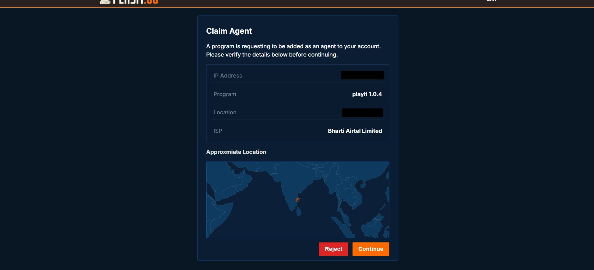
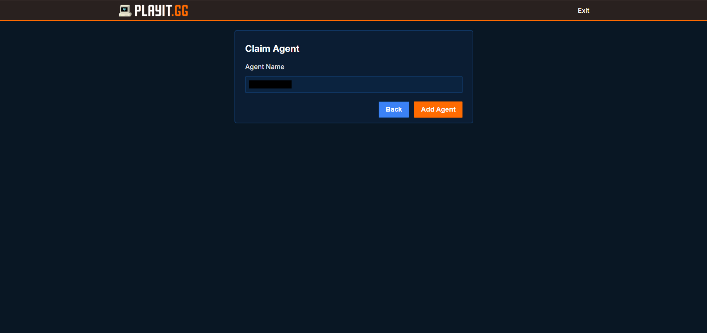
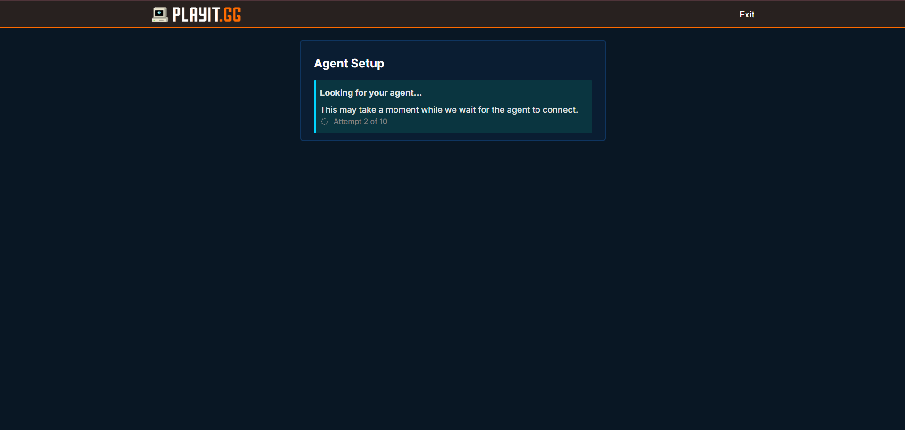
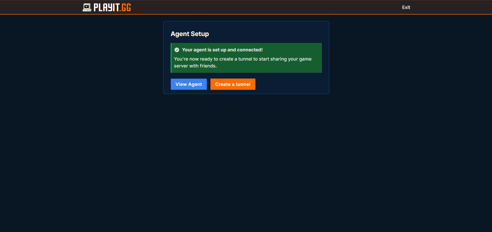
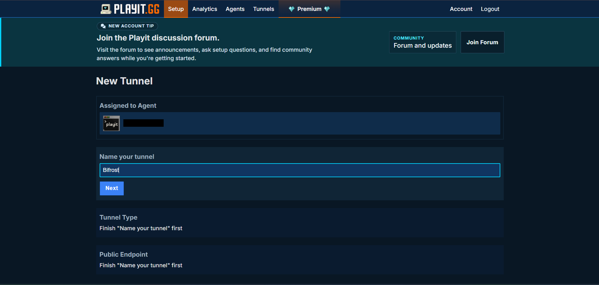
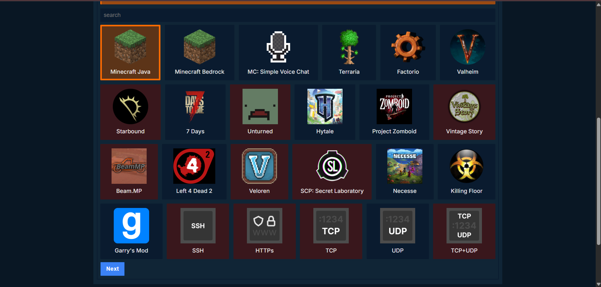
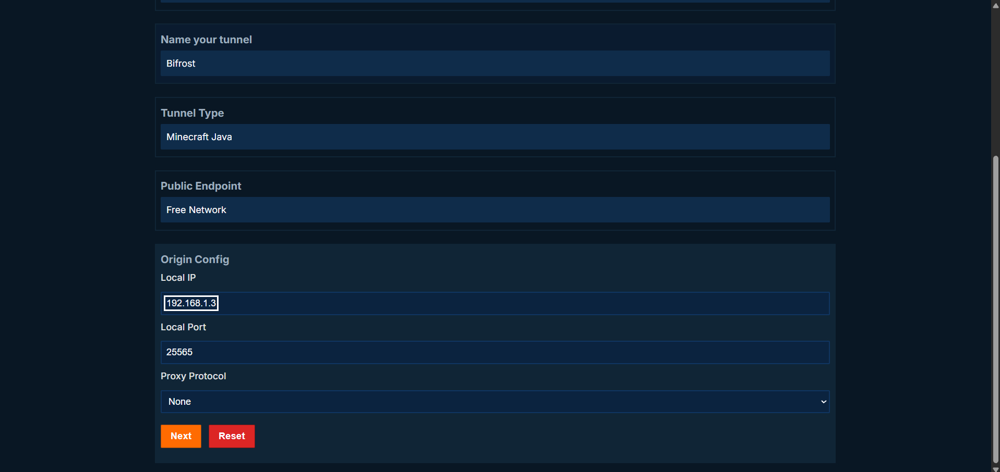
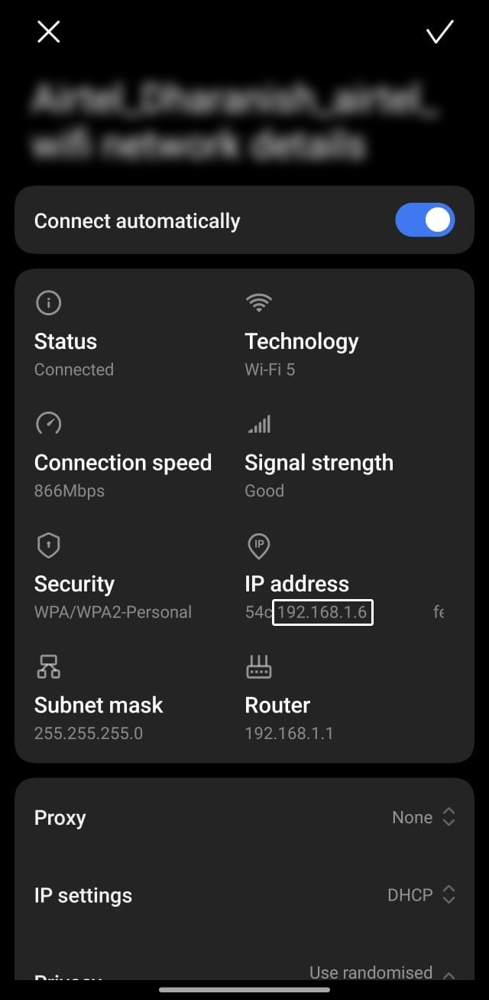
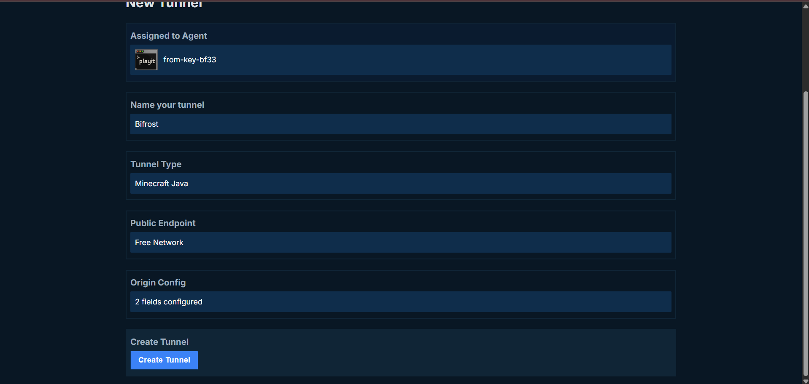
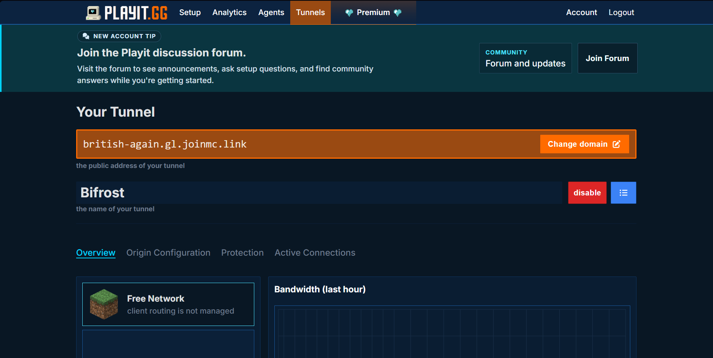

# Bifrost

Bifrost is a Minecraft Java server manager for Android.

It lets you create a server, run it from your phone, manage the world, and share it with friends without you to rent server using money or wait for long waiting period. Its a simple idea: your phone becomes yout own host, Bifrost handles the Minecraft server files, and Playit.gg helps you to play with your friends.

If you just want to start a world with friends and keep control of the files yourself, this app is built for that.

## How It Works

When you create a server Bifrost will download the need files and create server folder on your phone. 

When you press Start, Bifrost prepares the correct bundled Java runtime for your Minecraft version. Then it launches the server on the phone and watches its state. You can see whether the server is starting, running, stopping, stopped, or in an error state.

For local play, friends on the same Wi-Fi can join using your phone's local address and port `25565`.

For online play, you need a tunnel. Thats where Playit.gg comes in.

## Why Playit.gg Is Needed

Playit.gg allow you to play with your friends. Your phone keeps running the Minecraft server locally, and Playit gives you a public address that your friends can use to join.

You only need to set it up once for a server.

In monkey terms,
    Server sends packet to playit -> Playit send packet to friend -> Now Friend send packet to playit -> Playit send packet to server (cycle continues)

## Setting Up Playit.gg

These steps use the Playit desktop app. You will use it to create the tunnel, then your friends can join with the tunnel address.

### 1. Download Playit

Go to:

https://playit.gg/download/windows

Download and install the Playit app for Windows.

### 2. Open the Playit App

After installing it, open the app. It will provide you an account login link. Open that link in your browser.

### 3. Create or Log In to Your Account

If this is your first time using Playit.gg, create a new account. If you already have one, just log in.

### 4. Claim the Agent

After login, Playit should redirect you to a Claim Agent page. Press Continue.

Then create or add the agent when Playit asks.

### 5. Finish Agent Setup

The agent setup process will start. Wait for it to finish.

Once it is completed, click Create Tunnel.

### 6. Create the Minecraft Tunnel

On the tunnel creation page:

- Give the tunnel a name.
- Set the tunnel type to Minecraft Java.
- Leave the public endpoint as it is.
- In Origin Config, enter your phone's local IPv4 address.
- Set the local port to `25565`.
- Set proxy protocol to None.
- Click Next.

To find your phone's local IP address, open your phone's Wi-Fi settings, tap your connected Wi-Fi network, and look for the IPv4 address.

### 7. Copy the Tunnel Address

After the tunnel is created, open the tunnel dashboard. You will see the tunnel address there.

Copy that address and share it with the people who want to join your world.

Your friends should paste that Playit address into Minecraft Java Edition's multiplayer server list. They do not need to be on your Wi-Fi.

## Using Bifrost Day to Day

Create a server, start it, and wait until the status shows that it is running. If you are playing locally, use the local network address shown in the app.

If friends are joining from outside your network, start the Playit app and use the tunnel address from your Playit dashboard. Keep the Minecraft server running in Bifrost while people are connected.

Before turning off the server, use the Stop button. Bifrost sends the proper stop command so Minecraft can save world data safely.

## World Backups and Sync

Bifrost can create local backups of your world folder. It can also sync a world zip to Google Drive, which is useful if you want a backup outside your phone or want to share a world with another player.

If you are syncing while the server is online, Bifrost asks Minecraft to save the world first. That helps avoid broken or half-written world files.

## Permissions You May Need

Bifrost will ask for storage access because Minecraft server files are real folders and files on your device. If storage access is not granted, the app may not be able to create, delete, back up, or import server worlds correctly.

Battery optimization also matters. Some Android phones are aggressive about stopping background apps. If your server disconnects when the screen is off, open Bifrost settings and follow the battery optimization guidance there.

## Notes

- Minecraft Java servers normally use port `25565`.
- Vanilla and Paper servers are supported.
- Larger servers need more RAM, but phones have limits. Choose a sensible memory value.
- Keep backups before replacing or regenerating a world.
- Playit.gg is separate from Bifrost. Bifrost runs the server; Playit provides the public tunnel address.
- There will a warning when you try to login in with google account. Don't worry about the warning click advanced and continue with login process.

